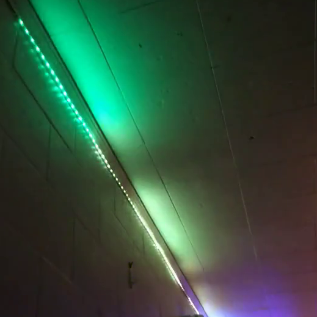
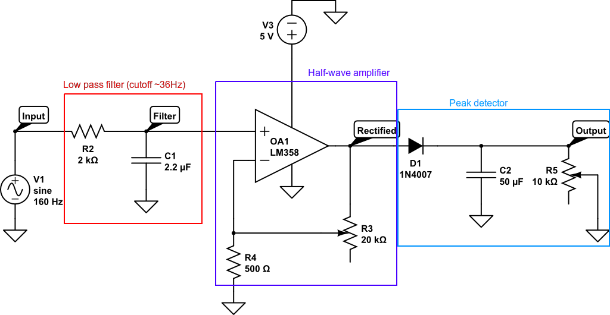
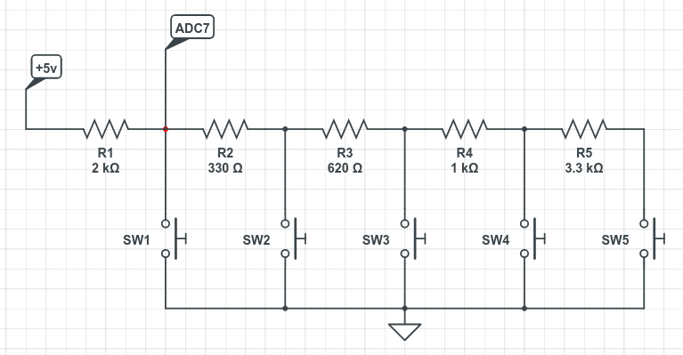

<!-- Improved compatibility of back to top link: See: https://github.com/othneildrew/Best-README-Template/pull/73 -->

<!--
*** Thanks for checking out the Best-README-Template. If you have a suggestion
*** that would make this better, please fork the repo and create a pull request
*** or simply open an issue with the tag "enhancement".
*** Don't forget to give the project a star!
*** Thanks again! Now go create something AMAZING! :D
-->

<!-- PROJECT LOGO -->
 

    

  <h3 align="center">LED Strip Visualizer</h3>

  

    Arduino project to visualize music using FastLED, WS2812B LEDs and analog circuity! Video of system in action is at the bottom of this README.
  

<!-- ABOUT THE PROJECT -->
## About The Project

This is a project using a spare Arduio-compatible board (DFRobot Romeo V2) for some fancy-looking music visualization. Uses a peak detector on low-frequency audio to produce a light show in time with rhythms in a song. This project has support for multiple visualizations, colors, and modes that are accessible by momentary push buttons when the system is powered on.

<!-- GETTING STARTED -->
## Getting Started

This is an example of how you may give instructions on setting up your project locally.
To get a local copy up and running follow these simple example steps.

### Prerequisites (Software)

You will need the following software
- Arduino IDE 
- FastLED

### Prerequisites (Hardware)

This original project was built with a DFRobot Romeo V2. However, any Arduino-compatible controller with two ADCs and compatibility with the FastLED library should work. Additionally, you will need:

- WS2812B LED strip (https://a.co/d/htWvjSR)
- 20k, 10k potentiometer
- 2k resistor
- 2.2uf, 50uf capacitor
- LM358 operational amplifier

If you are using a controller other than the Romeo V2 that does not have built-in buttons, you will need to build your own. For that, you will need:

- 5x momentary push buttons
- 220, 620, 1k, 2k, 3.3k resistor

### Installation

Upload the included ledStripVolume.iso sketch to the Arduino-compatible microcontroller. For this project, specific pin assignments were defined at the top of the sketch which will be used in the rest of the documentation:

- Pin A2 (ADC2) is used to read the value of the peak detector
- Pin 13 is tied to on-board LED for debugging purposes
- Pin 12 is held high to power analog circuitry (done to simplify wiring)
- Pin A7 (ADC7) is tied to on-board buttons for changing modes
- Pin 8 is used to transmit WS2812B data using FastLED

To install everything, create the circuitry below and connect to the controller. Then, to attach the LED strip, connect the data pin. Make sure that the +5v and GND connections to the LED strip come from an external power supply. The power requirements for longer strips are too high for many Arduino-compatible controllers (including the one used here).

#### The Peak Detector

This circuitry is used to filter low-frequency sound, amplify it to levels that the Romeo can detect, and apply peak detection to make loud sounds 'stick' for longer. In the circuit above, the following connections are made:

- 'Input' is connected to an audio source. For this work, my source had a peak-to-peak amplitude of around 0.5 volts
- 'Output' is connected to A2 on the Romeo

The potentiometers act as variable resistors that allow for the adjustment of the gain of the amplifier (R3) and the hold time of the peak detector (R5). 

#### Buttons (Optional)

Each button forms a voltage divider, changing the voltage at the ADC. For this project, the Romeo V2 board has built-in buttons attached to ADC7.

<!-- USAGE EXAMPLES -->
## Usage

Once everything is set up, the controller should start and wait for user input from the buttons. Settings can be changed as follows:

* Key 0 (SW1) enables debug messages sent over USB serial connection
* Key 1 (SW2) confirms settings and begins visualization
* Key 2 (SW3) changes visualization to 'cascade,' which shifts brightness down the strip over time
* Key 3 (SW4) enables random color switches on large changes in volume
* Key 4 (SW5) allows for cycling of the default color; hold the button to continue cycling

My personal favorite visualization is the 'cascade' visualization with random color switches. Below is a visualization of 'America 2' by The Midnight with these settings.

https://github.com/mattinglyas/ledStripVolume/assets/67919214/de9f1724-0f8d-48f8-8d97-ce672aa5146d

Once settings are input, press Key 1 to start visualization! Settings last until power off.
